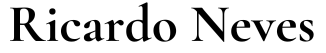

  

> Status: Desenvolvido ✅

## Sobre o Projeto

A aplicação é uma landing page que apresenta quem é Ricardo Neves e o que ele faz, mostra a participação dele em podcasts, e um livro que ele escreveu junto com outros escritores.

## link do projeto 
Acesse o [Projeto Ricardo Neves](https://pages.github.com/).

## Visualizar 🖼️

  
  

